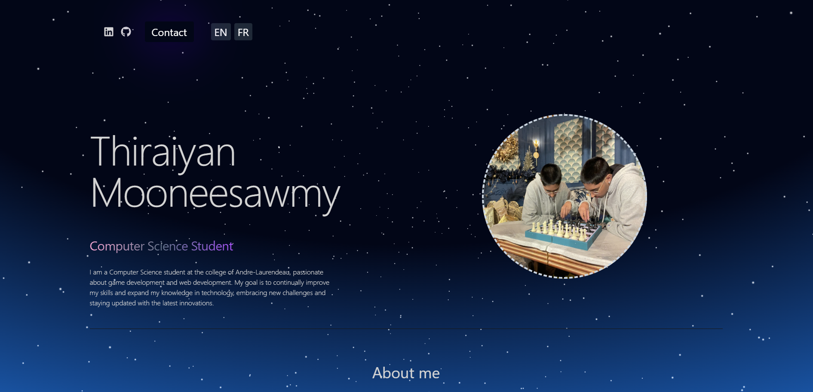

# Portfolio-2025

## https://niseiyen.github.io/Portfolio-2025/

## Description
Bienvenue sur mon portfolio! Ce projet met en avant mes compétences et mes réalisations dans les domaines de l'infromatique. Conçu comme une vitrine dynamique et interactive, ce portfolio est à la fois un outil de présentation et un projet d’apprentissage continu.

## Fonctionnalités principales
- **Page d’accueil** : Introduction et présentation rapide de mon parcours.
- **À propos** : Une section dédiée à en savoir plus sur moi, mon parcours, mes passions et mes objectifs professionnels.
- **Projets** : Une galerie de mes projets récents avec des descriptions, des images.
- **Compétences** : Liste de mes compétences.
- **Contact** : Les informations pour me contacter.
- **Responsive Design** : Une expérience utilisateur optimale sur ordinateur, tablette et mobile.

## Technologies utilisées
- **Frontend** : HTML5, CSS, JavaScript
- **Autres outils** : Tailwind, Framer Motion

## Capture décran

## Auteur
Thiraiyan Mooneesawmy

Retrouvez-moi sur :
- **LinkedIn** : https://www.linkedin.com/in/thiraiyan-mooneesawmy-99b8742b0/
- **GitHub** : https://github.com/Niseiyen

